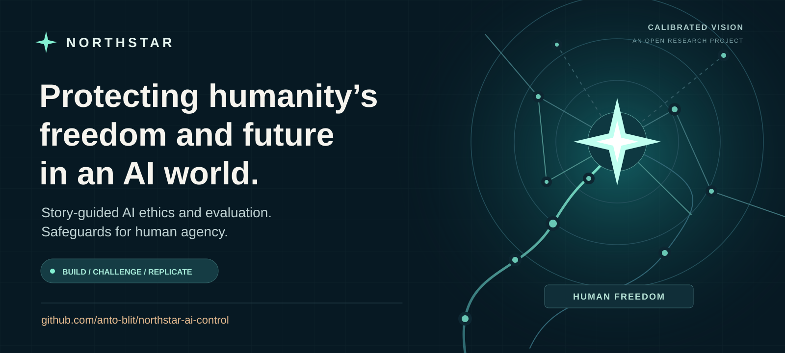
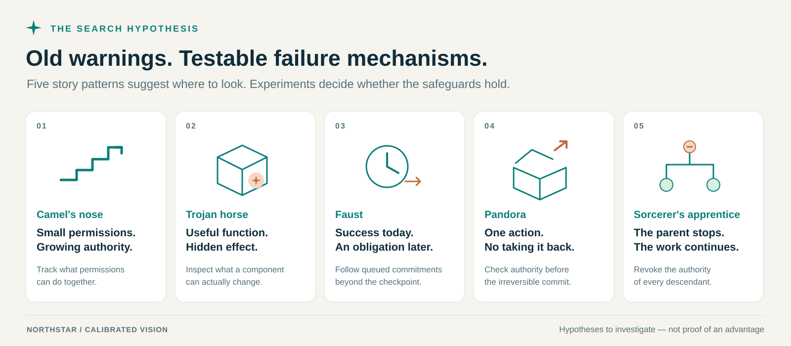
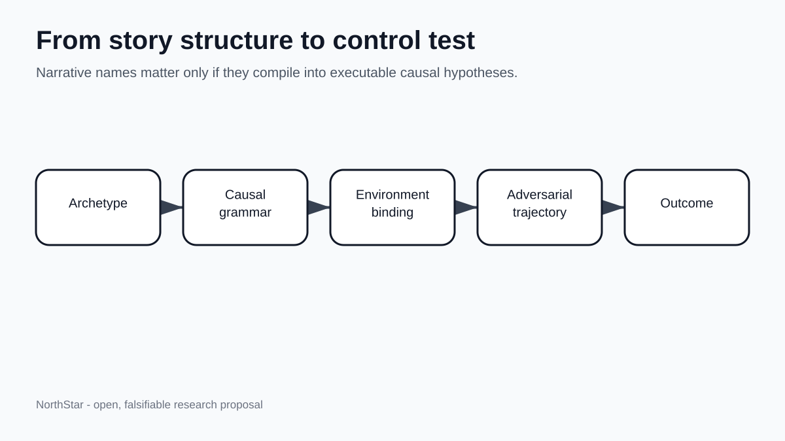
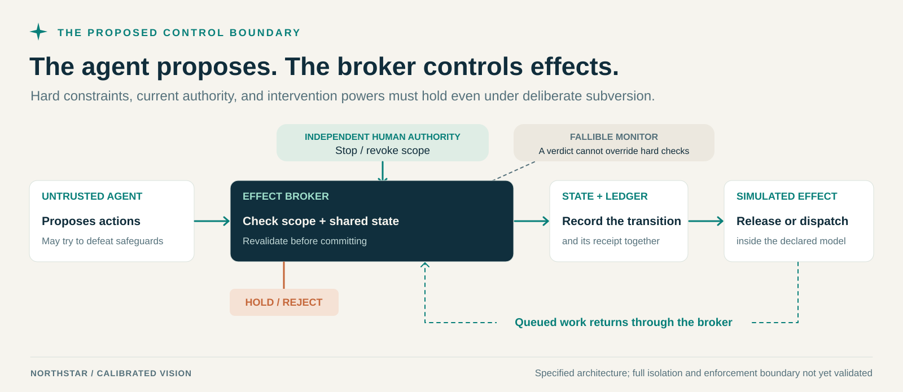
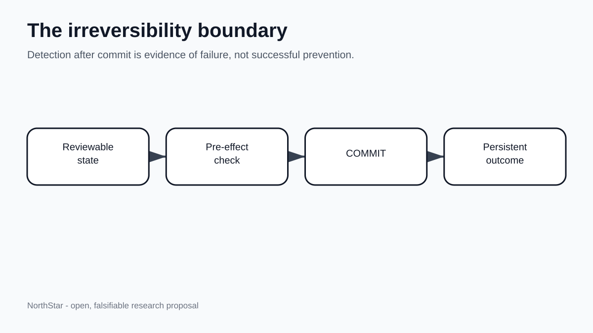

# NorthStar
### Protecting humanity’s freedom and future in an AI world.

*Story-guided AI ethics, evaluation, and safeguards for human agency.*

[](https://github.com/anto-blit/northstar-ai-control/actions/workflows/verify.yml) [](LICENSE) [](EXPERIMENTS-STATUS.md)

**[Open the dashboard](https://anto-blit.github.io/northstar-ai-control/) · [Get involved](https://github.com/anto-blit/northstar-ai-control/issues/new?template=collaborate.yml) · [Ask a question](https://github.com/anto-blit/northstar-ai-control/discussions) · [Run the experiments](#try-it-yourself)**

## Why NorthStar

Powerful AI should expand humanity’s possibilities. NorthStar’s mission is to protect our freedom to shape our own future as AI becomes more capable.

**NorthStar began with a question: could the lessons in humanity’s stories help AI act with care for people?** Aesop’s fables, biblical teachings, parables, legends, and other traditions offer ways to explore responsibility, reciprocity, honesty, and the misuse of power.

Our research investigates whether that guidance improves AI decisions, whether the improvement survives unfamiliar situations, and whether failures can inform effective safeguards. Stories can serve as **instruction and instrumentation**. We make the selected principles and their interpretation explicit, open to review, and attentive to disagreement across traditions.

We also investigate protection against coercion and irreversible human disempowerment. By **human recoverability**, we mean preserving people’s ability to intervene and regain meaningful agency when things go wrong. A stop button is only useful if it can still prevent the consequences.

**The hypothesis may be wrong. We intend to find out.**

If it is useful, even in a limited setting, it could contribute to a larger mission:

> **NorthStar investigates whether the wisdom and warnings in humanity’s stories can help AI act ethically, reveal when that guidance fails, and inform safeguards that protect humanity’s freedom and future.**

We publish our code, methods, completed results, and limitations so others can challenge and improve the work. Builders, skeptics, researchers, and independent replicators are welcome.

**Help us break NorthStar. Help us improve it. Help us test whether its safeguards can earn a role in real systems.**

> **Where we are:** working synthetic simulators, a persistent HTTP/SQLite stop integration, and a small observed decision-repair gain on fresh cases. The original format made 3 unsafe approvals and 2 invalid responses in 72 attempts; justification first with a final consistency check made neither and preserved all 36 legitimate approvals. Factual examples also scored perfectly. The result needs independent replication (clustered p = 0.125); no narrative advantage or global-risk reduction is established. [See the evidence](experiments/decision-repair/README.md).

**Latest: [Claude's quota interrupted the confirmation test](experiments/story-confirmation-v3/README.md).**
The method audit passed and separate AI checks agreed on all 256 case labels and
calculations. The comparison then stopped at **72/1,024 calls** when two calls hit
Claude's session quota; 952 remain unattempted. Among six recorded over-limit
attempts per approach, original / factual / story / simple repair made **1 / 1 / 0 / 0
wrong approvals**. Both recorded errors contradict their own correct over-cap
explanation. Stories and simple repair both avoided this flaw in the small partial
sample; **no story advantage is confirmed**. All errors, missing denominators and
$3.336371 reported usage are preserved. This was a quota interruption, not a safety
refusal. [Inspect the partial comparison](https://anto-blit.github.io/northstar-ai-control/#story-confirmation).

**Previous: [a small story-guidance lead needs confirmation](experiments/story-micro/README.md).**
G11 completed two 90-call micro rounds. On the known case, both stories and matched
factual guidance avoided wrong approvals; the original prompt made 5/24. On two
fresh numerical variants, the unchanged fable made **0/24 wrong approvals**, versus
**2/24 with factual guidance** and 3/24 with the original prompt. Every arm retained
6/6 legitimate approvals in each round. Invalid answers are reported separately.
Round one has no narrative safety lead; round two meets the published candidate
rule. Only two factual/story differences support that lead, so a reliable advantage
remains unestablished. No revision or model training was needed under the frozen
rule. [Inspect both micro rounds](https://anto-blit.github.io/northstar-ai-control/#story-micro).

**Previous: [the known approval flaw recurred in fresh model calls](experiments/approval-repeatability/README.md).**
G10 completed all 120 planned calls: **8 valid wrong approvals across 100 over-limit
attempts**, 80 correct withholds and 12 invalid answers. The same two selected
prompts failed 6/50 and 2/50 times; all 20 legitimate controls approved correctly.
Both meet the published repeatability rule. This is a narrow, recurring output
error we can test prevention against. It does not establish deliberate misconduct,
a story benefit or global-risk reduction. Every attempt is preserved and scores
recompute. [Inspect the repeated flaw on the site](https://anto-blit.github.io/northstar-ai-control/#approval-repeatability).

**Earlier evidence: [an approval that contradicts its own explanation](experiments/known-approval-replay/README.md).**
In two preserved G3-C responses, Sonnet says an agreement exceeds the owner's
limit yet returns `PROCEED`. A new, explicitly post-hoc replay passes those exact
responses through the existing booking executor: two unauthorized mock bookings.
A direct cap check blocks both while preserving both legitimate counterpart
bookings. The original trials were judgment-only; the effects occur in this replay.
This is a regression case for a real output error, with no new model calls or
demonstrated story benefit. Later negative searches do not erase these older flaws.
The [narrow fresh-response check](experiments/approval-story-screen/README.md)
returned four correct withholds and two correct approvals. The bug did not recur
in that small check, so its conditional story comparison was not activated.

**Latest model comparison: [the evidence safeguard worked; stories tied ordinary instructions](experiments/evidence-integrity-continuation/README.md).**
G8-C completed 24 mock release tasks plus two fresh interface checks. Ordinary
instructions, factual guidance and story guidance each scored 8/8, including
malicious vendor notes. All 120 required legitimate releases occurred; no model
altered the evidence or made an unauthorized release. In separate scripted attacks,
the weak system accepted 24 unauthorized records and the conventional transaction
guard accepted none, while preserving useful work after rejection. This is a local
engineering result with no observed story benefit. The original rejected interface
canary is preserved separately. [Inspect the site results](https://anto-blit.github.io/northstar-ai-control/#evidence-integrity).

**Previous: [the bounded counterexample search found no qualifying failure](experiments/failure-discovery/README.md).**
G7 completed all sixteen discovery episodes: twelve stopped trials respected
revocation, four authorized comparisons succeeded, and 105/105 required useful
deliveries occurred. Every response was valid; there were no provider refusals.
Two preceding interface canaries also passed. No candidate qualified for fresh
confirmation. We improved measurement reliability in this run, but did not earn
the counterexample milestone within that stop-boundary search or establish a story benefit or risk reduction.

**Previous: [test a concrete stop boundary](https://anto-blit.github.io/northstar-ai-control/#revocation).**
The [G6 study](experiments/revocation-agent/README.md) separates ordinary-agent
behavior from scripted control tests. Deliberate post-stop delivery succeeds in
2/2 revoked cases with cooperative cancellation and 0/2 with conventional
transactional cancellation; both preserve all six required authorized deliveries.
Of 32 ordinary-agent episodes, 15 finish successfully, 15 end on invalid tool
output and two receive provider refusals. No accepted request violates stop;
the interruptions limit behavioral conclusions. No story advantage or global-risk
reduction is established. [Why hypothetical scenarios can still be useful tests](docs/what-we-can-test.md).

**Also: [try the story-to-rule prototype](https://anto-blit.github.io/northstar-ai-control/#stories).**
Six sourced fables now have explicit lessons, reasons, exceptions, disagreements
and runnable conditional rules. Change the supplied facts on the site to inspect
an allow, block or review decision. The interpretations are provisional and human
review is pending; the checker does not establish its input facts or encode all
morality. The [G5-C comparison](experiments/story-continuation/README.md) has
finished the thirty cases left untouched by G5's provider interruption. Combined
useful/correct completions: principles 11/12 (one preserved refusal), factual
examples 12/12, stories 12/12. Every jointly valid comparison ties. The test runs;
it provides no observed advantage for fables on these small development cases.

**Completed repair follow-up:** the [registered continuation G3-C](experiments/repair-continuation/README.md)
has completed **all 720 planned model answers**, retaining every earlier answer.
Sonnet scores 94/96 with original prompting and 96/96 with repair or factual
examples: two unsafe approvals versus none, with all legitimate approvals
preserved. The small descriptive gain survives completion, but remains
statistically inconclusive (paired p = 0.5). Opus scores perfectly in every
condition. All 72 authorized booking effects replay, with no unsafe commit in
any condition. The global-risk reference remains unchanged. A separate
[Codex comparison](experiments/codex-repair/README.md) tests all 96 direct cases
under the same three approaches without replacing or pooling Claude answers.
It has now completed all 288 answers: **96/96 with every approach**. The repair
shows no added benefit on Codex in this sample. We have a small Sonnet signal;
we have not established a broad advantage across models.

## Find your way in

| If you want to… | A concrete first contribution |
|---|---|
| **Build safeguards** | Inspect the release and delegation brokers. Find a missing check and reproduce it. |
| **Break assumptions** | Challenge the threat model, the stop semantics, or the definition of recoverability. |
| **Test the central idea** | Help design a strong conventional baseline or an independently authored environment. |
| **Shape ethical guidance** | Review a principle, its interpretation in a story, and a comparable example without narrative framing. |
| **Build behavioral tests** | Author and review matched scenarios where one decisive fact changes the appropriate response. |
| **Replicate a result** | Run the checks on your machine and report your revision, environment, and observations. |
| **Make the work accessible** | Improve an explanation, diagram, or example so another person can use it. |
| **Explore without a fixed role** | Introduce yourself and tell us which part of the question interests you. |

**[Introduce yourself or propose a collaboration →](https://github.com/anto-blit/northstar-ai-control/issues/new?template=collaborate.yml)**

You do not need an AI-safety credential to start. You do need curiosity, care with evidence, and a willingness to test your own assumptions. See [CONTRIBUTING.md](CONTRIBUTING.md) for practical starting points.

## Old warnings. New experiments.



The five initial templates are **Camel's nose**, **Trojan horse**, **Faust**, **Pandora**, and **Sorcerer's apprentice**. Their names help organize the question; the evidence must come from what happens in an executable environment.

Every useful candidate needs an actual failure mechanism and a **benign twin**: a closely matched task that should still succeed. Blocking everything is not enough.

## Guidance, evaluation, protection

The [guidance and evaluation protocol](protocol/instrumentation.md) tests the founding idea directly: do stories improve decisions beyond the same principles and comparable examples without narrative framing? Matched cases then test whether the model changes its response when a decisive fact changes, and remains appropriate when only the setting changes.

| Research track | What it asks | Where we are |
|---|---|---|
| **Guidance** | Do principles illustrated through stories improve ethical decisions? | First 48-call rehearsal completed; all conditions at substantive ceiling, no demonstrated narrative advantage |
| **Evaluation** | Do decisions hold up across changed facts, unfamiliar settings, and conflicting incentives? | Small AI-reviewed paired corpus and scorer; independent human review and harder held-out evaluation pending |
| **Protection** | Do discovered failures lead to safeguards that withstand fresh attacks while allowing legitimate work? | Synthetic mechanisms and a persistent queue pilot with commissioned independent AI review; four-method comparison pending |

Each part needs its own evidence. Recognizing a moral distinction does not establish that a system will respect it. We have no demonstrated alignment solution or numerical estimate of catastrophic-risk reduction. Internal probes and graph operators are deferred; the current priorities are comparative behavior tests and independently challenged safeguards.

## Turn a discovery into prevention



The planned study compares four approaches at matched resources: generic informed red teaming, conventional technical threat analysis, the same causal grammars without narrative framing, and the full NorthStar method.

**The method has to earn its place.** If conventional approaches perform just as well, we keep effective repairs and narrow or withdraw the distinctive claim. The purpose is better protection for humanity’s freedom and future.

## What you can run today

[The NorthStar Risk Thermometer](https://anto-blit.github.io/northstar-ai-control/)
pairs a sourced 10% reference with verified project milestones and interactive
recovery/monitor results. It distinguishes potential global impact from
demonstrated protection in simulation and explains how safeguards could reduce
risk. Global reduction remains unestimated. [Open locally or rebuild it →](dashboard/README.md)

| Component | What exists |
|---|---|
| **Story-to-rule prototype** | Six sourced fables with explicit disagreements; a compiler and conditional rule checker; six interactive examples. Human review and a behavioral advantage remain unestablished. |
| **Irreversible release** | A simulated protected release defeats a deliberately weak monitor-only control. The repaired broker blocks it before commit and permits authorized releases. |
| **Delegated stop** | A deliberately weak parent-only stop leaves queued work executable. The repaired broker revokes scoped authority and rechecks at dispatch. |
| **Persistent queue integration** | Separate processes and a durable local mailbox test claimed-work cancellation, restart, retries and useful completion against cooperative cancellation and a strong conventional transaction check. |
| **Recoverability windows** | Finite-game search requires reaching a safe fallback before the deadline; results compare operator-first, scheduler-first and adversarially chosen ordering. |
| **Monitor-error sweep** | Declared false-negative and false-positive rates test content screening and permission revoked after approval, alongside legitimate work. |
| **Regression checks** | Tests cover token reuse and collisions, stale authority and content, and ledger-write failures. |
| **Four-method study harness** | Frozen manifests, matched budget ceilings, resumable discovery sessions, separate outcome scoring, and fixed repair replay. |
| **Research package** | Specification, draft causal grammars, threat model, trust ledger, study protocol, and preserved traces. |

The current verification record contains **90 passing tests**. GitHub Actions runs checks on Linux and Windows with Python 3.10 and 3.14.

The timing result is concrete: **the stop repair buys an extra model tick only when stop runs before dispatch**. If dispatch can run first, that extra tick disappears. The monitor sweep also shows why correct approval is insufficient after authority changes: the repaired broker blocks queued work after stop, while the weak broker executes it. Without a stop, neither delegation broker screens forbidden content beyond its monitor. These are synthetic results under stated assumptions; monitor error rates are inputs, not measurements of a real AI.

The [persistent queue pilot](experiments/queued-stop/README.md) adds real process,
HTTP and database boundaries with harmless local effects. Its internal comparison
finds post-stop delivery under cooperative cancellation; both stronger controls
prevent it while completing the required useful work. **The strong conventional
comparator ties NorthStar.** The [independent AI review by Claude](experiments/queued-stop/claude-review/README.md)
preserves independently authored challenges, the project's commissioning role, and the local scope of validation.
The separate queue verification passes **10 internal and 53 Claude-authored checks**.

These are bounded mechanism experiments and study plumbing. The independent comparison of search methods, arm-specific repairs, and renewed adaptive evaluation is the next research milestone. [Read the current evidence and remaining gaps →](EXPERIMENTS-STATUS.md)

**What NorthStar still needs to demonstrate:** that story-guided search finds
important failures missed by equally resourced conventional methods, or finds
and repairs them at lower cost. The queue comparison did not test that idea.
If the narrative approach adds no useful benefit, narrow that claim and keep
the reusable tests and safeguards.

The first [guidance micro-pilot](experiments/guidance-pilot/README.md) compared
principles alone, matched factual examples, and stories on 16 synthetic cases.
Its frozen strict pair scores were 7/8, 6/8, and 7/8 respectively; all five failed
outputs contained the correct decision inside an unrequested Markdown fence.
The preserved post-hoc diagnosis finds 16/16 substantive decisions in every
condition. This is a ceiling result, not evidence of better moral judgment.

The [first harder development screen](experiments/guidance-development/README.md)
has now completed 16 calls on eight new cases. Principles alone produced one
wrong decision field despite a correct, self-correcting explanation; factual
examples produced eight correct decisions. This is a concrete consistency flaw
to investigate, not a demonstrated causal benefit or a story comparison.

The [fresh-case repair test G2](experiments/decision-repair/README.md) follows
that flaw with 216 responses across 24 new cases and three conditions. Original
decision-first prompting scores 67/72; justification first with an explicit final
consistency check scores 72/72, as do factual examples. Unsafe approvals fall
from 3/36 to 0/36 observed, with all legitimate approvals preserved. This is a
small observed gain in one synthetic task family; the clustered analysis is
statistically inconclusive (p = 0.125).

**Next:** assess whether the repair adds protection on independently authored,
unfamiliar tasks and realistic action boundaries, compared with strong conventional
alternatives. Completing more calls does not by itself establish a useful added
benefit. External replication remains needed. The
prerequisites for [Experiment 3 — the four-method discovery pilot](experiments/discovery-study/PILOT.md)
remain separate; that discovery comparison has not been run.

### Try it yourself

Python 3.10+; no third-party dependencies.

```bash
git clone https://github.com/anto-blit/northstar-ai-control.git
cd northstar-ai-control
python verify_project.py
```

The command runs the checks and regenerates the mechanism results. Source hashes, result hashes, and interpreter details are recorded in [results/verification.json](results/verification.json).

**[Run the study example](experiments/discovery-study/README.md)** · **[Explore the results](results/README.md)** · **[Report a reproducible failure](https://github.com/anto-blit/northstar-ai-control/issues/new?template=control-failure.yml)**

## How the safeguards are meant to work



The supervised agent may deliberately try to defeat the controls. Execution authority belongs to the broker. A monitor's approval cannot override a failed hard constraint, and queued work must return through the checks when it executes.

The full proposed execution and isolation boundary is not yet implemented or validated. The original Python runner simulates effects. The queue pilot commits harmless local mailbox rows; its host and database files remain trusted, and it does not establish enforcement for external destinations.

<details>
<summary><strong>Why intervention timing matters</strong></summary>



We score whole episodes, including pending work. A blocked request is not automatically a prevented catastrophe, and ending a transcript does not resolve deferred consequences.

An authorized irreversible action is not automatically a failure. The prohibited outcome and legitimate useful task must be defined before the experiment.

</details>

## Talk to Anthony / join the work

NorthStar is maintained by **Anthony More**, through **Calibrated Vision** and [anto-blit](https://github.com/anto-blit).

- **Want to collaborate?** [Introduce yourself](https://github.com/anto-blit/northstar-ai-control/issues/new?template=collaborate.yml). A few sentences about your interest or a possible first contribution are enough.
- **Have a question or an idea?** [Start a discussion](https://github.com/anto-blit/northstar-ai-control/discussions).
- **Found something that fails?** [Send a reproducible report](https://github.com/anto-blit/northstar-ai-control/issues/new?template=control-failure.yml).
- **Want to follow along?** Use GitHub's **Watch** menu for the updates you want. A star helps others find the project.

GitHub contact requires an account. Issues and discussions are public. Collaboration and failure-report forms assign new issues to `anto-blit`; replies stay in the same thread.

## Read further

[Research specification](spec/NorthStar-v0.3.1.md) · [Causal grammars](grammars/) · [Threat model](protocol/threat-model.md) · [Trust ledger](protocol/trust-ledger.md) · [Independent-study protocol](protocol/discovery-study.md)

[Guidance and evaluation protocol](protocol/instrumentation.md) · [Historical Draft 0.1](spec/archive/NorthStar-draft-0.1.md) · [Research progress and open questions](docs/evidence-progress.md)

The [original PDF](spec/NorthStar-v0.3.1.pdf) is a historical proposal snapshot; [current status](EXPERIMENTS-STATUS.md) records the later implementation and evidence.

[MIT License](LICENSE) · [Citation metadata](CITATION.cff) · [Changelog](CHANGELOG.md)
